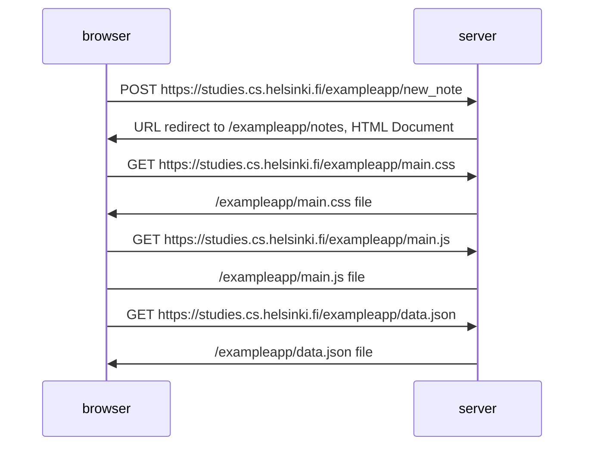
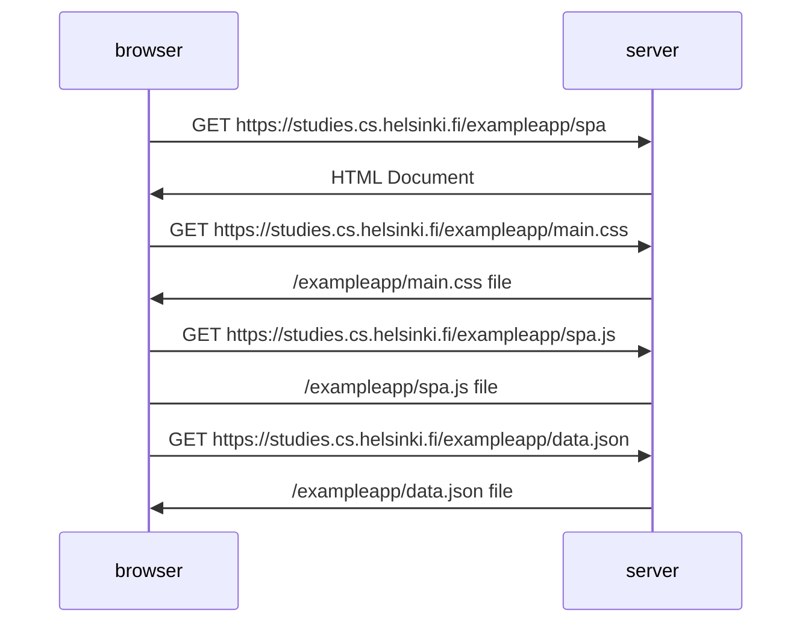

Exercise 0.4 New note diagram



Exercise 0.5 Single app diagram



Exercise 0.6 New note in Single page app diagram

```mermaid
sequenceDiagram
    participant browser
    participant server
    browser->>server: POST /exampleapp/new_note_spa
    server->>browser: responds "note created"
